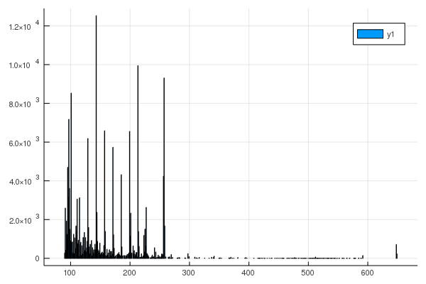

### Spectral Based Targeted GCMS Analysis

This is a small project looking at doing targeted spectral-based analysis of GCMS data. The first data set includes fatty acid methyl esters (FAMEs). Reference spectra and retention times are given in the "Fames-msp.txt" file and a few sample GCMS files are given. The code requires that GCMS files be converted to .CDF as we are using the NetCDF package in julia to read the files.

At this point an example script is given in script.jl that can be run line by line as an example. The contents are included below in this README. I chose to start processing the data scan by scan in this project as this can tie into other spectral based machine learning techniques, and will be much faster than alignment approaches in the long run. Although writing this all new will take some time.

**Current Work:**
- pull out quality of match information for each scan and library spectra
- use qualty of match information to locate retention time of peaks
- determine total signal from analyte
- include error metrics for use in the evaluation of results

## Example Script
instal NetCDF and Plots package if they are not installed
```julia
Pkg.add("NetCDF")
Pkg.add("Plots")
```

Make sure we are in the right directory, and load NetCDF, GCMS functions, and MSP reading functions
```julia
cd("/home/marneyl/gcms_julia/")
using NetCDF
include("gcms-scans.jl")
include("read-msp.jl")
```

Pick a gcms.CDF file and get some information about it. Take a look at what is available in scan_index, scan_acquisition_time, mass_range_max, and point_count.
```julia
filename = "DG024.CDF"
scan_index, scan_acquisition_time, mass_range_max, point_count = scaninfo(filename)
```

Then we can load the MS data into an array with MSdata() and make some plots. Be sure to load Plots in julia before trying to plot anything! Lets just look at the TIC.
```julia
using Plots
data = MSdata(filename)
TIC = getTIC(data, scan_index, scan_acquisition_time, point_count)
plot(TIC[:,1], TIC[:,2])
```


We can get information on a particular MS scan as well. The retention time of the scan is given by the variable rt. For scan 2046 it is 1447.219 seconds, or 24.12 min, very close to where C15 would elute according to our MSP file.
```julia
i = 2046 # select a scan
scan_index[i]
msscan = data[scan_index[i]+1:scan_index[i]+point_count[i],:]
rt = scan_acquisition_time[i]
bar(msscan[:,1],msscan[:,2]) # plot the scan
```


We can also read in library spectra from msp file, requires read-msp.jl file to be read. Holy cow this was a complicated piece of logic to write! Fun! Be sure to look at the structure of mslibrary. It is a Dictionary, which behaves very simalarly to a hashtable.
```julia
mslibrary = mspDict("Fames-msp.txt")
libspectra = mslibrary["C15"]
bar(libspectra[:,1],libspectra[:,2])
```
